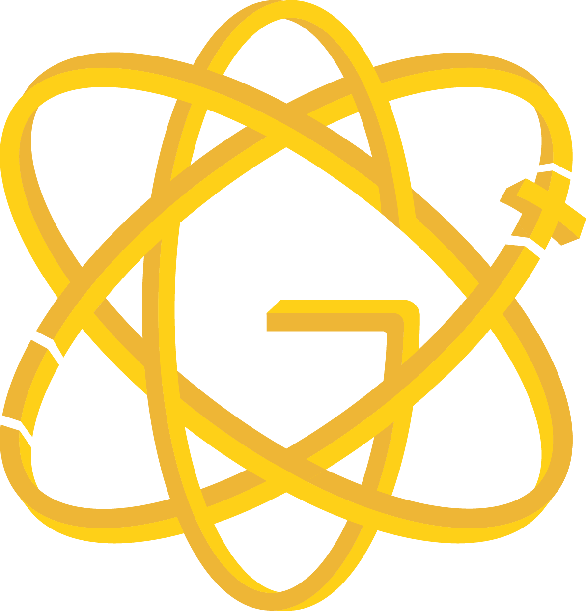

<!-- Don't delete it -->
<div name="readme-top"></div>

<!-- Organization Logo -->
<div align="center" style="display: flex; align-items: center; justify-content: center; gap: 16px;">
  
  <!--  -->
  
</div>

&nbsp;

<!-- Organization Name -->
<div align="center">

[](https://hammer-auctions.stability.nexus/)

<!-- Correct deployed url to be added -->

</div>

<!-- Organization/Project Social Handles -->
<p align="center">
<!-- Telegram -->
<a href="https://t.me/StabilityNexus">
</a>
&nbsp;&nbsp;
<!-- X (formerly Twitter) -->
<a href="https://x.com/StabilityNexus">
</a>
&nbsp;&nbsp;
<!-- Discord -->
<a href="https://discord.gg/YzDKeEfWtS">
</a>
&nbsp;&nbsp;
<!-- Medium -->
<a href="https://news.stability.nexus/">
  </a>
&nbsp;&nbsp;
<!-- LinkedIn -->
<a href="https://linkedin.com/company/stability-nexus">
  </a>
&nbsp;&nbsp;
<!-- Youtube -->
<a href="https://www.youtube.com/@StabilityNexus">
  </a>
</p>

---

<div align="center">
<h1>Gluon Stablecoin Protocol</h1>
</div>

Gluon is novel autonomous crypto-backed stablecoin protocol.

This repository contains the source-code of the UI for the Gluon Gold implementation of Gluon deployed on Ergo.

This UI was built with Next.js, Tailwind CSS, Shadcn UI, Zustand, Framer Motion, and bun as package manager.

## 🚀 Getting Started

Install bun, if you don't have it already, you can find it [here](https://bun.sh/docs/installation).

If you don't want to use bun, you can always use NPM or PNPM.

1. Install dependencies:

```bash
bun install
```

2. Start the development server:

```bash
bun dev
```

### Adding Shadcn Components

To install new shadcn components:

```bash
bun x shadcn@latest add <component-name>
```

or with NPM / PNPM:

```bash
npx shadcn@latest add <component-name>
```

While working with shadcn, all components are installed to src/lib/components/ui
You will have access to the core component file, which means you can edit the whole component as you please.

> ⚠️ **Note:** Avoid reinstalling existing components when prompted, as this will reset any custom styling in the component files.

## 📁 Folder Structure

The project follows a modular approach. Components or functions that will be used multiple times should be designed to accept various props or be moved to separate files.

### Directory Overview

```
src/
├── lib/
│   ├── components/          # All React components
│   │   ├── ui/             # Shadcn UI components
│   │   ├── blocks/         # Page-specific sections (dashboard, home)
│   │   ├── layout/         # Layout components (navbar, sidebar, SEO)
│   │   ├── blockchain/     # Wallet and protocol integrations
│   │   └── icons/          # Custom icon components
│   ├── constants/          # Application constants and addresses
│   ├── functions/          # Business logic and protocol functions
│   ├── hooks/              # Custom React hooks
│   ├── providers/          # Context providers (Ergo, theme)
│   ├── services/           # External service integrations
│   ├── stores/             # State management (Zustand)
│   ├── types/              # TypeScript type definitions
│   └── utils/              # Utility functions and helpers
├── pages/                  # Next.js pages and API routes
└── styles/                 # Global styles and CSS
```

### Component Organization Guidelines

- **UI Components**: All shadcn-related components go in `lib/components/ui`
- **Page Sections**: Add page-specific sections (e.g., dashboard stats) in `components/blocks`
- **Layout Components**: Place layout elements (navbar, sidebar, footer) in `components/layout`
- **Blockchain Components**: Wallet connectors and protocol interactions in `components/blockchain`
- **New Features**: Create dedicated folders in appropriate locations

## 🔗 Gluon SDK Integration

The application integrates with the Gluon Gold SDK for protocol interactions:

### Key Integration Points

- **Protocol Data**: Real-time price feeds, volume metrics, and reserve ratios
- **Wallet Integration**: Balance fetching and transaction handling via ErgoProvider
- **Network Support**: Automatic testnet/mainnet detection and configuration

### Usage Pattern

```typescript
const gluon = new sdk.Gluon();
gluon.config.NETWORK = process.env.NEXT_PUBLIC_DEPLOYMENT || "testnet";
const gluonBox = await gluon.getGluonBox();
const oracleBox = await gluon.getGoldOracleBox();
```

## 🎨 Design System

### Dashboard Architecture

- **Real-time Data**: Protocol metrics update every 5 minutes, ERG price every 30 minutes
- **Responsive Design**: Mobile-first approach with proper breakpoints
- **Motion Design**: Framer Motion for smooth animations and transitions
- **Theming**: Full dark/light mode support with shadcn theming

### Data Formatting Standards

- **Decimals**: Meaningful precision for small numbers (GAU/GAUC show 6 decimals)
- **Large Numbers**: Smart formatting (K/M/B notation)
- **Loading States**: Skeleton loaders for all data fetching
- **Error Handling**: Graceful fallbacks with user feedback

## 🏷️ Naming Conventions

| Type                       | Convention | Example                                            |
| -------------------------- | ---------- | -------------------------------------------------- |
| Small UI Components        | kebab-case | `my-new-component.tsx` → export as `YourComponent` |
| Complex Components         | PascalCase | `ThisComponentName.tsx`                            |
| Single Functions           | camelCase  | `useThisFunction.ts`, `getThisValue.ts`            |
| Multiple Functions / Utils | kebab-case | `error-handler.ts`, `node-service.ts`              |
| Constants                  | UPPERCASE  | `LIKE_THIS.ts`                                     |

## 💡 Deploying on Vercel

1. Configure Vercel to deploy from the `mainnet` branch.
2. Get a coingecko API key from https://www.coingecko.com/en/developers/dashboard .
3. Configure your Vercel environment variables as shown in the first screenshot below.
4. Configure your Vercel Framework settings as shown in the second screenshot below.


## 🔄 Pull Request Workflow

### Branch Structure

- `mainnet` - Production branch
- `testnet` - Development/testing branch
- `develop` - Feature integration branch

### Development Process

1. Create feature branches from `develop`: `yourname/feature-name`
2. Submit PR to `testnet` with detailed description
3. After testing on testnet deployment, it will be merged to `mainnet`
4. Feature branches may be deleted after merging to mainnet

### Environment Handling

Environment variables are used for network detection. Code should be compatible with both testnet and mainnet:

```typescript
// Network configuration
gluon.config.NETWORK = process.env.NEXT_PUBLIC_DEPLOYMENT || "testnet";

// Environment-specific logic
if (process.env.NEXT_PUBLIC_DEPLOYMENT === "testnet") {
  // testnet-specific code
  // wallet checkers, explorer URLs, etc.
}
```

## 💡 Best Practices

### TypeScript Guidelines

- Type everything possible to improve code quality
- Avoid unnecessary interfaces
- Keep type definitions simple and practical for day-to-day reading
- Add types to `src/lib/types` to keep the codebase clean and organized

### Component Development

- **Props Design**: Create reusable components with flexible props
- **Error Boundaries**: Implement proper error handling in components
- **Loading States**: Always provide loading feedback for async operations
- **Accessibility**: Include proper ARIA labels and keyboard navigation

### Protocol Integration

- **Data Polling**: Use appropriate intervals (avoid overwhelming the network)
- **Error Recovery**: Implement retry logic for failed API calls
- **Cache Strategy**: Cache protocol data when appropriate
- **Real Data**: Always prefer real protocol data over mocked values

### Performance Guidelines

- **Bundle Size**: Monitor component bundle impact
- **Re-renders**: Use React.memo and useMemo appropriately
- **Animation**: Keep animations smooth and purposeful
- **Responsive Images**: Optimize images for different screen sizes

### Collaborative Development

- Follow established conventions
- Respect team members' work
- Share and discuss implementation ideas
- Test thoroughly on both testnet and mainnet
- Maintain a clean and organized codebase

---

For questions or discussions, [please join our Discord community.](https://discord.gg/fGEprQNT9P)
